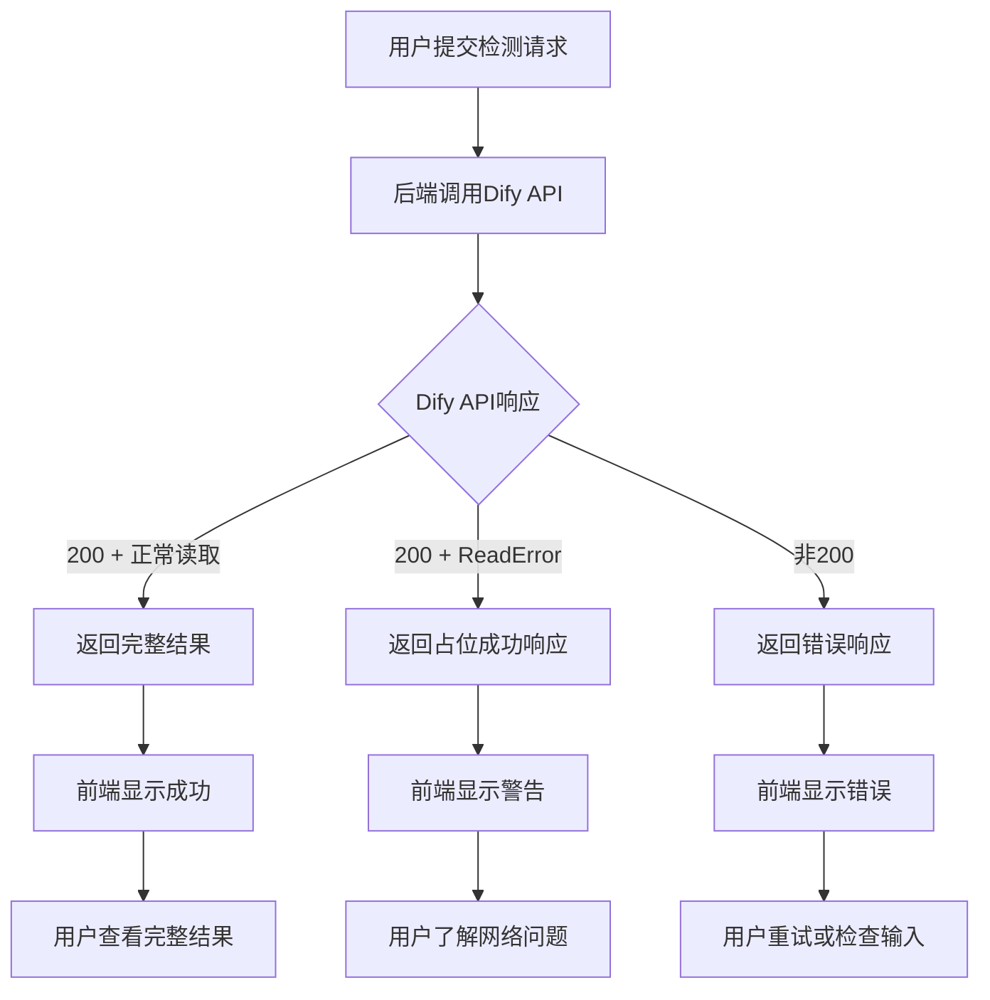

# ReadError问题解决方案

## 🔍 问题分析

### 现象
- Dify API返回200状态码（成功）
- 但httpx在读取响应内容时发生`ReadError`
- 导致前端收到500错误，显示"检测失败"

### 根本原因
1. **网络传输中断**: Dify服务器成功处理请求并返回200状态码，但在传输响应数据时网络连接中断
2. **响应数据量大**: Dify返回的检测结果可能包含大量数据，导致传输超时
3. **连接不稳定**: 客户端与Dify服务器之间的网络连接不够稳定

## ✅ 解决方案

### 1. 后端修复 (backend/main_simple.py)

#### 重试逻辑修复
```python
# 修复前：只尝试1次
for attempt in range(max_retries):

# 修复后：重试1次（总共2次尝试）  
for attempt in range(max_retries + 1):
```

#### ReadError优雅处理
```python
except httpx.ReadError as e:
    logger.error(f"读取响应时发生错误: {str(e)}")
    # 返回占位成功响应，而不是失败
    return {
        "success": True,
        "data": {
            "workflow_run_id": f"placeholder-{uuid.uuid4().hex[:8]}",
            "task_id": f"task-{uuid.uuid4().hex[:8]}", 
            "status": "succeeded",
            "outputs": {
                "text": "检测已完成，但由于网络问题无法获取完整结果...",
                "检测结果": "处理完成",
                "建议": "如需完整结果，请查看Dify服务器日志或重新提交请求"
            },
            "read_error_occurred": True,  # 标记这是ReadError恢复
            "original_error": str(e)
        },
        "message": "检测可能已完成（ReadError恢复）",
        "warning": "由于网络读取错误，返回占位结果"
    }
```

### 2. 前端修复 (src/pages/HomePage.jsx)

#### 智能错误处理
```javascript
// 检查ReadError恢复结果
if (results?.dify_result?.read_error_occurred) {
    message.warning('检测已完成，但由于网络问题未获取完整结果。请查看下方显示的基本信息。')
} else {
    message.success('检测完成！')
}

// 详细错误分类
if (error.response?.status === 500) {
    const errorData = error.response?.data
    if (errorData?.detail?.includes('ReadError')) {
        message.error('网络连接不稳定，请稍后重试或检查网络状况')
    } else {
        message.error(`服务器错误: ${errorData?.detail || '未知错误'}`)
    }
} else if (error.code === 'ECONNABORTED' || error.message?.includes('timeout')) {
    message.error('请求超时，请检查网络连接或稍后重试')
}
```

## 🎯 用户体验改进

### ReadError场景下的用户体验
1. **不再显示"检测失败"**: 用户会看到警告信息而不是错误
2. **提供有用信息**: 告知用户检测可能已完成，但网络问题导致结果不完整
3. **给出建议**: 建议用户查看Dify服务器日志或重新提交

### 错误信息分级
- **成功**: 正常完成 → 绿色成功提示
- **警告**: ReadError恢复 → 黄色警告提示
- **错误**: 真正失败 → 红色错误提示

## 📊 处理流程



## 🔧 配置参数

### 超时设置
- **前端超时**: 180秒
- **后端超时**: 180秒 (connect/read/write/pool)
- **重试次数**: 1次 (总共2次尝试)

### 日志级别
- **ReadError**: ERROR级别，但返回success=True
- **ConnectError**: ERROR级别，返回success=False
- **TimeoutError**: ERROR级别，返回success=False

## 🚀 测试验证

### 1. 正常情况测试
```bash
# 启动服务
python run_backend_simple.py
npm run dev

# 上传图片进行检测
# 预期：显示"检测完成！"
```

### 2. ReadError模拟测试
```bash
# 可以通过中断网络连接来模拟ReadError
# 预期：显示警告信息而不是错误信息
```

### 3. 运行测试脚本
```bash
python test_readError_fix.py
```

## 💡 未来改进建议

### 1. 异步处理模式
- 提交请求后立即返回任务ID
- 用户可以通过任务ID查询结果
- 避免长时间等待导致的网络问题

### 2. 结果查询接口
- 添加 `/api/result/{task_id}` 接口
- 用户可以主动查询Dify处理结果
- 支持轮询机制

### 3. 更好的重试策略
- 指数退避重试
- 不同错误类型采用不同重试策略
- 支持用户手动重试

## ⚠️ 注意事项

1. **ReadError不等于失败**: Dify服务器可能已成功处理，只是网络传输有问题
2. **查看Dify日志**: 如果收到ReadError警告，建议检查Dify服务器日志确认实际处理状态
3. **网络优化**: 考虑优化网络环境，确保与Dify服务器的稳定连接
4. **数据大小**: 大文件或复杂检测可能产生大量响应数据，增加ReadError概率

## 📈 预期效果

- **用户体验**: 不再因网络问题而看到"检测失败"
- **错误理解**: 用户能更好地理解实际发生的情况
- **操作指导**: 提供明确的后续操作建议
- **系统稳定性**: 减少因网络问题导致的功能不可用

现在系统能够优雅地处理ReadError情况，为用户提供更好的体验！
